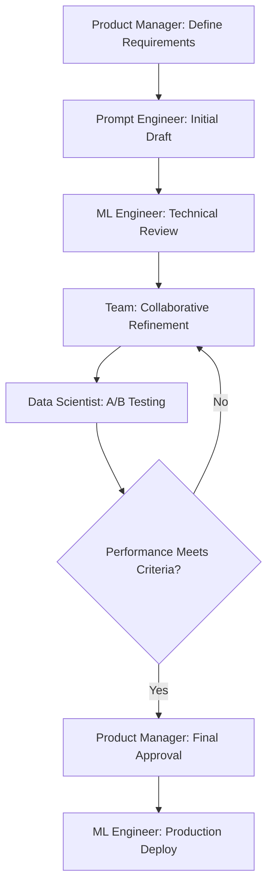
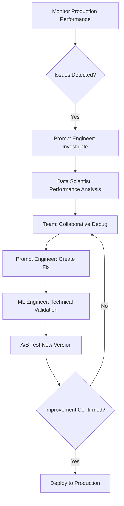

# 👥 Team Collaboration Patterns & Requirements Research

**Mission:** Analyze team workflows and collaboration requirements for enterprise prompt engineering  
**Focus:** Real-world patterns, tool requirements, and workflow optimization

---

## 🎯 Current Collaboration Gap Analysis

### **ContextForge Current State**
- ✅ **Single-user local-first architecture**
- ✅ **Advanced individual productivity features**
- ❌ **No multi-user support**
- ❌ **No real-time collaboration**
- ❌ **No team management**
- ❌ **No role-based permissions**

### **Critical Collaboration Missing**
```yaml
Team Management:
  - User accounts and authentication
  - Organization/workspace management  
  - Team member invitations and onboarding
  - Role-based access control

Real-time Collaboration:
  - Simultaneous editing
  - Conflict resolution
  - Live cursors and presence
  - Comment and review system

Workflow Management:
  - Approval workflows  
  - Review processes
  - Version control with team features
  - Change tracking and notifications
```

---

## 📊 Enterprise Team Workflow Analysis

### **Typical Team Composition**
```yaml
Product Teams (3-8 people):
  - Product Manager (1): Requirements and strategy
  - ML Engineers (2-3): Model integration and optimization
  - Prompt Engineers (1-2): Prompt design and testing
  - Data Scientists (1-2): Analysis and evaluation
  - DevOps Engineer (1): Deployment and monitoring

Roles and Responsibilities:
  Product Manager:
    - Define prompt requirements and success criteria
    - Review and approve prompt changes
    - Manage project timelines and priorities
    - Coordinate with business stakeholders
  
  ML Engineers:
    - Integrate prompts with applications
    - Optimize model selection and parameters
    - Handle production deployment
    - Monitor performance and reliability
  
  Prompt Engineers:  
    - Design and iterate on prompt content
    - Conduct A/B testing and evaluation
    - Optimize for quality and consistency
    - Manage prompt libraries and templates
  
  Data Scientists:
    - Analyze prompt performance data
    - Design evaluation frameworks
    - Generate insights and recommendations
    - Create performance dashboards
```

### **Common Collaboration Workflows**

#### **1. New Prompt Development**


#### **2. Prompt Optimization Cycle**


#### **3. Cross-team Knowledge Sharing**
```yaml
Weekly Rituals:
  - Prompt review sessions
  - Performance retrospectives  
  - Best practice sharing
  - Template and library updates

Documentation Requirements:
  - Prompt design rationale
  - Performance benchmarks
  - Usage guidelines
  - Troubleshooting guides

Knowledge Base:
  - Prompt templates library
  - Evaluation frameworks
  - Best practices documentation
  - Case studies and examples
```

---

## 🏗️ Required Collaboration Features

### **Core Team Platform Features**

#### **1. Multi-tenant Authentication System**
```typescript
interface TeamAuthSystem {
  organizations: Organization[];
  users: User[];
  invitations: TeamInvitation[];
  ssoIntegrations: SSOProvider[];
  
  // Core capabilities
  createOrganization(name: string, plan: Plan): Organization;
  inviteUser(email: string, role: Role, org: string): Invitation;
  authenticateUser(credentials: Credentials): AuthResult;
  authorizeAction(user: User, resource: Resource, action: Action): boolean;
}
```

#### **2. Role-Based Access Control**
```yaml
Role Hierarchy:
  Owner:
    - Full organization control
    - Billing and plan management
    - Add/remove team members
    - All prompt permissions
  
  Admin:
    - Team management
    - Workspace configuration
    - All prompt permissions
    - Usage analytics access
  
  Editor:
    - Create and edit prompts
    - Run tests and evaluations
    - Comment and collaborate
    - View team analytics
  
  Reviewer:
    - Review and approve prompts
    - Comment on changes
    - View prompt history
    - Read-only analytics
  
  Viewer:
    - Read-only access to prompts
    - View public comments
    - Basic usage only
    - No sensitive data access

Resource Permissions:
  Prompts:
    - create, read, update, delete
    - publish, archive, restore
    - test, evaluate, optimize
    - comment, review, approve
  
  Teams:
    - invite, remove, manage
    - view, edit profiles
    - assign roles, permissions
  
  Analytics:
    - view performance data
    - access cost information
    - export reports
    - configure monitoring
```

#### **3. Real-time Collaborative Editing**
```typescript
interface CollaborativeEditor {
  // Core editing capabilities
  realTimeSync: boolean;
  conflictResolution: ConflictStrategy;
  presenceIndicators: UserPresence[];
  
  // Collaboration features
  liveComments: Comment[];
  suggestions: Suggestion[];
  changeTracking: ChangeHistory[];
  
  // Editor state
  participants: ActiveUser[];
  editingMode: EditingMode;
  lockingStrategy: LockingStrategy;
}
```

### **Advanced Collaboration Requirements**

#### **4. Review and Approval Workflow**
```yaml
Approval Workflows:
  Basic Review:
    - Single reviewer approval
    - Comment-based feedback
    - Simple approve/reject
  
  Multi-stage Review:
    - Technical review (ML Engineer)
    - Content review (Prompt Engineer)  
    - Business approval (Product Manager)
    - Sequential or parallel reviews
  
  Automated Gates:
    - Performance threshold checks
    - Safety filter validation
    - Cost impact analysis
    - A/B test result validation

Review Features:
  - Inline commenting
  - Suggestion mode editing
  - Approval tracking
  - Change request management
  - Review deadline management
  - Notification system
```

#### **5. Advanced Version Control for Teams**
```typescript
interface TeamVersionControl {
  // Enhanced Git-like features
  branches: Branch[];
  pullRequests: PullRequest[];
  mergeStrategies: MergeStrategy[];
  
  // Team collaboration
  reviewers: Reviewer[];
  approvals: Approval[];
  conflicts: ConflictResolution[];
  
  // Advanced features
  semanticMerge: boolean;        // AI-powered merge conflict resolution
  intelligentBranching: boolean; // Auto-suggest branch strategies
  impactAnalysis: ImpactReport;  // Analyze change implications
}
```

---

## 🎨 User Experience Patterns

### **Onboarding and Team Setup**
```yaml
Organization Setup:
  1. Admin creates organization
  2. Configures team settings and permissions
  3. Invites team members with appropriate roles
  4. Sets up integrations (SSO, monitoring, etc.)
  5. Creates initial workspace structure

Member Onboarding:
  1. Receives invitation email
  2. Creates account or signs in via SSO
  3. Completes profile setup
  4. Takes product tour with role-specific guidance
  5. Joins first project and prompt review
```

### **Daily Collaboration Workflows**
```yaml
Morning Routine:
  - Check notifications and mentions
  - Review assigned prompts and requests
  - Update status and availability
  - Join team standup (if applicable)

Active Collaboration:
  - Real-time editing with team members
  - Leave comments and suggestions
  - Respond to review requests
  - Run collaborative tests and evaluations

End of Day:
  - Update work status
  - Review completed work
  - Set up next day priorities
  - Check team progress updates
```

### **Communication and Notification System**
```typescript
interface NotificationSystem {
  channels: NotificationChannel[];
  preferences: UserPreferences[];
  integrations: ExternalIntegration[];
  
  // Notification types
  mentions: MentionNotification[];
  approvals: ApprovalNotification[];
  changes: ChangeNotification[];
  deadlines: DeadlineNotification[];
  
  // Delivery methods
  inApp: boolean;
  email: boolean;
  slack: SlackIntegration;
  teams: TeamsIntegration;
}
```

---

## 🔗 Integration Requirements

### **Essential Third-party Integrations**

#### **Communication Platforms**
```yaml
Slack Integration:
  - Prompt update notifications
  - Review request alerts
  - Performance monitoring alerts
  - Team activity summaries
  - Direct link to prompts/reviews

Microsoft Teams:
  - Similar to Slack capabilities
  - Office 365 SSO integration
  - SharePoint document integration
  - Teams meeting bot for reviews

Discord (for smaller teams):
  - Bot for notifications
  - Embed prompt previews
  - Quick commands for status
```

#### **Development and Project Management**
```yaml
Git Platforms:
  - GitHub integration for code deployment
  - GitLab for enterprise teams
  - Bitbucket for Atlassian ecosystem

Project Management:
  - Jira for issue tracking
  - Linear for modern teams
  - Asana for marketing teams
  - Monday.com for operations

Documentation:
  - Notion for comprehensive docs
  - Confluence for enterprise wiki
  - GitBook for public documentation
```

#### **Monitoring and Analytics**
```yaml
Observability:
  - DataDog for APM integration
  - New Relic for performance monitoring
  - Grafana for custom dashboards

Business Intelligence:
  - Looker for data analysis
  - Tableau for visualization
  - Power BI for Microsoft ecosystem
```

---

## 📱 Platform-Specific Requirements

### **Web Application Features**
```yaml
Essential Features:
  - Responsive design for all devices
  - Progressive Web App (PWA) capabilities
  - Offline editing with sync
  - Keyboard shortcuts for power users
  - Dark mode and theming options

Advanced Features:
  - Split-screen collaboration view
  - Multi-tab workspace management
  - Drag-and-drop file management
  - Advanced search and filtering
  - Custom dashboard configuration
```

### **Mobile Considerations**
```yaml
Mobile-First Features:
  - Review and approve on mobile
  - Push notifications for urgent items
  - Quick comment and feedback
  - Basic editing capabilities
  - Offline reading access

Native App Considerations:
  - iOS/Android native apps for key users
  - Push notification support
  - Native sharing capabilities
  - Biometric authentication
  - Deep linking to specific prompts
```

---

## 🎯 Competitive Collaboration Benchmarks

### **Best-in-Class Examples**

#### **Figma (Design Collaboration)**
```yaml
Collaboration Excellence:
  - Real-time multiplayer editing
  - Live cursors and presence
  - Voice chat during editing
  - Comment threads on specific elements
  - Version history with thumbnails
  - Component libraries and design systems

Applicable to ContextForge:
  - Real-time prompt editing
  - Live presence in workspace
  - Voice comments on prompts
  - Thread-based discussions
  - Visual version comparison
  - Prompt template libraries
```

#### **GitHub (Code Collaboration)**
```yaml
Workflow Excellence:
  - Pull request review system
  - Inline commenting on changes
  - Approval workflow management
  - Automated testing integration
  - Issue tracking and projects
  - Team and organization management

Applicable to ContextForge:
  - Prompt review requests
  - Inline suggestions and comments
  - Multi-stage approval workflows
  - Automated testing integration
  - Issue tracking for prompts
  - Team workspace organization
```

#### **Notion (Document Collaboration)**
```yaml
Knowledge Management:
  - Real-time collaborative editing
  - Comment and suggestion system
  - Template and block libraries
  - Database views and filters
  - Team permissions and sharing
  - Rich media and embeds

Applicable to ContextForge:
  - Collaborative prompt editing
  - Rich commenting system
  - Prompt template libraries
  - Advanced filtering and views
  - Granular sharing controls
  - Rich prompt documentation
```

---

## 🚀 Implementation Roadmap

### **Phase 1: Foundation (Weeks 1-6)**
```yaml
Core Authentication:
  - Multi-tenant user system
  - Organization management
  - Basic role-based access
  - Team invitations

Basic Collaboration:
  - Shared workspace access
  - Comment system
  - Basic version control
  - Simple notifications
```

### **Phase 2: Real-time Collaboration (Weeks 7-12)**
```yaml
Live Editing:
  - Real-time collaborative editor
  - Conflict resolution system
  - Live presence indicators
  - Change tracking

Enhanced Workflows:
  - Review and approval system
  - Advanced commenting
  - Pull request workflow
  - Integration foundations
```

### **Phase 3: Advanced Enterprise (Weeks 13-18)**
```yaml
Enterprise Features:
  - SSO integration
  - Advanced permissions
  - Audit logging
  - Compliance features

Integrations:
  - Slack/Teams notifications
  - GitHub/GitLab integration
  - Project management tools
  - Advanced analytics
```

---

## 📊 Success Metrics

### **Collaboration Effectiveness KPIs**
- **<2 hours** average review cycle time
- **90%+** team adoption within 30 days
- **50%+** reduction in prompt iteration time
- **80%+** user satisfaction with collaboration features
- **95%+** uptime for real-time features

### **Business Impact Metrics**
- **3x faster** prompt development cycles
- **60%** reduction in miscommunication issues
- **40%** improvement in prompt quality scores
- **70%** increase in prompt reuse across teams
- **50%** reduction in duplicate work

---

*Team Collaboration Research - CompetitorAnalyst Agent*