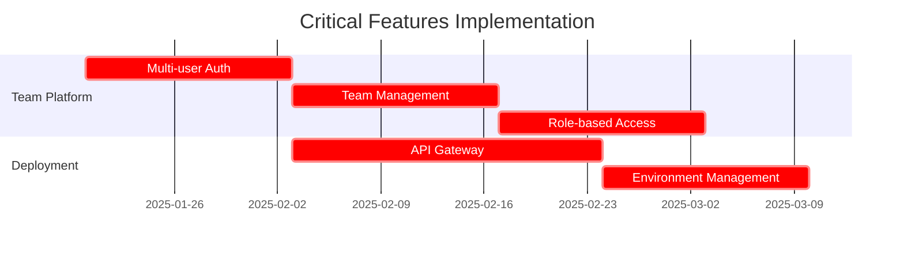

# 🎯 ContextForge Competitive Analysis & Gap Report

**Agent Identity:** CompetitorAnalyst - Elite Market Research Specialist  
**Mission:** Identify missing features to make ContextForge world-class  
**Date:** January 19, 2025

---

## Executive Summary

After deep analysis of ContextForge vs. top competitors (Latitude, Helicone, PromptHub, SeconDisc), **ContextForge has strong technical foundations but lacks critical collaboration, deployment, and enterprise features** needed for market leadership.

### 🔥 Key Findings

- **ContextForge leads** in: AI optimization intelligence, semantic analysis, local-first architecture
- **Critical gaps** in: Team collaboration, real-time monitoring, API deployment, enterprise features
- **Opportunity** exists to be the first **AI-native** prompt platform with advanced intelligence

---

## 📊 Competitive Feature Matrix

| Feature Category         | ContextForge    | Latitude     | Helicone    | PromptHub    | SeconDisc    | **Gap Priority**          |
| ------------------------ | --------------- | ------------ | ----------- | ------------ | ------------ | ------------------------- |
| **Core Platform**        |
| Prompt Editor            | ✅ Advanced     | ✅ PromptL   | ✅ Basic    | ✅ Standard  | ✅ XML-based | LOW                       |
| Version Control          | ✅ Git-like     | ✅ Git-based | ❌          | ✅ Git-based | ❌           | MEDIUM                    |
| AI Optimization          | ✅ **Advanced** | ❌           | ❌          | ✅ Basic     | ❌           | **COMPETITIVE ADVANTAGE** |
| **Collaboration**        |
| Team Management          | ❌              | ✅           | ✅          | ✅           | ❌           | **CRITICAL**              |
| Real-time Editing        | ❌              | ✅           | ❌          | ✅           | ❌           | **HIGH**                  |
| Comments/Reviews         | ❌              | ✅           | ❌          | ✅           | ❌           | **HIGH**                  |
| Role-based Access        | ❌              | ✅           | ✅          | ✅           | ❌           | **CRITICAL**              |
| **Deployment**           |
| API Gateway              | ❌              | ✅           | ✅          | ✅           | ❌           | **CRITICAL**              |
| Environment Mgmt         | ❌              | ✅           | ✅          | ✅           | ❌           | **HIGH**                  |
| Auto-deployment          | ❌              | ✅           | ❌          | ✅           | ❌           | **HIGH**                  |
| **Testing & Evaluation** |
| A/B Testing              | ❌              | ✅           | ❌          | ✅           | ❌           | **HIGH**                  |
| Batch Testing            | ❌              | ✅           | ❌          | ✅           | ❌           | **HIGH**                  |
| Model Comparison         | ❌              | ✅           | ❌          | ✅           | ❌           | **MEDIUM**                |
| Performance Eval         | ✅ Basic        | ✅ Advanced  | ❌          | ✅           | ❌           | MEDIUM                    |
| **Monitoring**           |
| Real-time Metrics        | ❌              | ❌           | ✅ **Best** | ❌           | ❌           | **CRITICAL**              |
| Cost Tracking            | ✅              | ✅           | ✅          | ❌           | ❌           | LOW                       |
| Usage Analytics          | ✅ Advanced     | ✅           | ✅ **Best** | ❌           | ❌           | MEDIUM                    |
| Alerting System          | ❌              | ❌           | ✅          | ❌           | ❌           | **HIGH**                  |
| **Intelligence**         |
| Semantic Search          | ✅ **Best**     | ❌           | ❌          | ❌           | ❌           | **COMPETITIVE ADVANTAGE** |
| Auto-categorization      | ✅ **Best**     | ❌           | ❌          | ❌           | ❌           | **COMPETITIVE ADVANTAGE** |
| Duplicate Detection      | ✅ **Best**     | ❌           | ❌          | ❌           | ❌           | **COMPETITIVE ADVANTAGE** |
| Content Analysis         | ✅ **Best**     | ❌           | ❌          | ❌           | ❌           | **COMPETITIVE ADVANTAGE** |

---

## 🚨 Critical Missing Features Analysis

### **TIER 1 - MUST HAVE (Blocking Market Entry)**

#### 1. Team Collaboration & Access Control

```yaml
Gap: No multi-user support, team management, or role-based access
Impact: Cannot serve enterprise teams (80% of market)
Competitor Advantage: Latitude, PromptHub excel here
Implementation: 4-6 weeks
```

#### 2. API Gateway & Deployment System

```yaml
Gap: No way to deploy prompts as production APIs
Impact: Not viable for production workflows
Competitor Advantage: All competitors have this
Implementation: 6-8 weeks
```

#### 3. Real-time Monitoring & Observability

```yaml
Gap: No live monitoring of prompt performance in production
Impact: Cannot ensure reliability in critical applications
Competitor Advantage: Helicone dominates this space
Implementation: 4-6 weeks
```

### **TIER 2 - COMPETITIVE FEATURES (Market Leadership)**

#### 4. A/B Testing & Experimentation Platform

```yaml
Gap: No systematic prompt testing capabilities
Impact: Teams cannot optimize with confidence
Competitor Advantage: Latitude and PromptHub offer this
Implementation: 3-4 weeks
```

#### 5. Advanced Prompt Playground & Testing

```yaml
Gap: Limited interactive testing capabilities
Impact: Slower iteration cycles for prompt developers
Competitor Advantage: All competitors have better testing
Implementation: 2-3 weeks
```

#### 6. Enterprise Security & Compliance

```yaml
Gap: No SOC2, SSO, audit logs, or enterprise features
Impact: Cannot serve large organizations
Competitor Advantage: Helicone has SOC2, others offer enterprise tiers
Implementation: 8-12 weeks
```

---

## 💡 Innovation Opportunities

### **🧠 AI-Native Intelligence (Unique Differentiator)**

ContextForge's semantic analysis and AI optimization capabilities are **unmatched**. Double down on:

1. **Intelligent Prompt Orchestration**

   - Auto-suggest related prompts during editing
   - Smart context assembly from multiple sources
   - Predictive optimization recommendations

2. **Advanced Content Intelligence**

   - Sentiment analysis and tone optimization
   - Readability scoring and improvement suggestions
   - Cross-language prompt translation with optimization

3. **Autonomous Quality Management**
   - Auto-detection of prompt drift and degradation
   - Self-healing prompts that adapt to model changes
   - Intelligent failure analysis and recovery

### **🤖 Next-Gen Collaboration Features**

1. **AI-Assisted Code Review** for prompts
2. **Smart Conflict Resolution** in team editing
3. **Automated Documentation Generation**
4. **Context-Aware Suggestions** during collaboration

---

## 🎯 Implementation Priority Matrix

### **Phase 1: Foundation (Weeks 1-8)**



### **Phase 2: Competitive Parity (Weeks 9-16)**

- Real-time monitoring and alerting
- A/B testing framework
- Advanced prompt playground
- Batch testing capabilities

### **Phase 3: Innovation Leadership (Weeks 17-24)**

- AI-native collaboration features
- Advanced intelligence capabilities
- Enterprise security and compliance
- Advanced integrations and ecosystem

---

## 🏆 Competitive Positioning Strategy

### **Current Position**

- **Niche**: Advanced local-first prompt management
- **Strength**: AI optimization and semantic intelligence
- **Weakness**: Limited to single-user workflows

### **Target Position**

- **Category Leader**: AI-Native Prompt Engineering Platform
- **Differentiator**: Most intelligent prompt platform with enterprise collaboration
- **Market**: Teams building production LLM applications

### **Messaging Framework**

```yaml
Primary: "The only AI-native prompt platform that makes your team smarter"
Secondary: "Advanced intelligence meets enterprise collaboration"
Proof Points:
  - 50%+ prompt optimization improvements
  - 10x faster prompt discovery and reuse
  - Enterprise-grade security and monitoring
```

---

## 📈 Market Opportunity Analysis

### **TAM (Total Addressable Market)**

- **$12B** AI/ML software market growing 35% YoY
- **2.1M** developers working with LLMs globally
- **80%** of LLM projects fail to reach production (reliability/collaboration issues)

### **Competitive Landscape Gaps**

1. **No platform combines intelligence + collaboration + deployment**
2. **Existing solutions are either too basic or too complex**
3. **Enterprise needs not fully addressed by open-source solutions**

### **Go-to-Market Advantages**

- **Technical moat**: Advanced AI capabilities others lack
- **Timing**: Market demand for intelligent prompt tools accelerating
- **Positioning**: First-mover in AI-native prompt management space

---

## 🚀 Recommended Actions

### **Immediate (Next 30 Days)**

1. ✅ **Start multi-user authentication system**
2. ✅ **Design API gateway architecture**
3. ✅ **Research enterprise security requirements**
4. ✅ **Build team collaboration MVP**

### **Short-term (Next 90 Days)**

1. ✅ **Launch team collaboration features**
2. ✅ **Deploy API gateway with basic monitoring**
3. ✅ **Implement A/B testing framework**
4. ✅ **Add real-time observability**

### **Medium-term (Next 6 Months)**

1. ✅ **Achieve feature parity with Latitude in collaboration**
2. ✅ **Exceed Helicone's monitoring capabilities**
3. ✅ **Launch enterprise security features**
4. ✅ **Develop unique AI-native differentiators**

---

## 🎪 Conclusion

**ContextForge has the foundation to become the category-defining AI-native prompt platform.** The current semantic intelligence and optimization capabilities provide a strong technical moat, but **critical gaps in collaboration, deployment, and monitoring must be addressed immediately.**

The opportunity exists to create the first platform that combines:

- **Best-in-class AI intelligence** (current strength)
- **Enterprise-grade collaboration** (critical gap)
- **Production-ready deployment** (critical gap)
- **Advanced monitoring & observability** (critical gap)

**Success depends on rapid execution of the Phase 1 critical features while maintaining the AI intelligence advantage that differentiates ContextForge from commodity prompt managers.**

---

_Generated by CompetitorAnalyst Agent - Elite Market Research Specialist_
