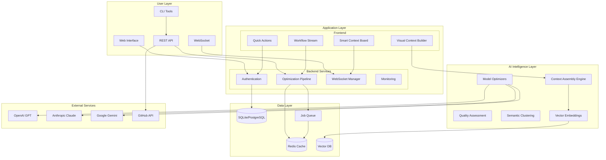
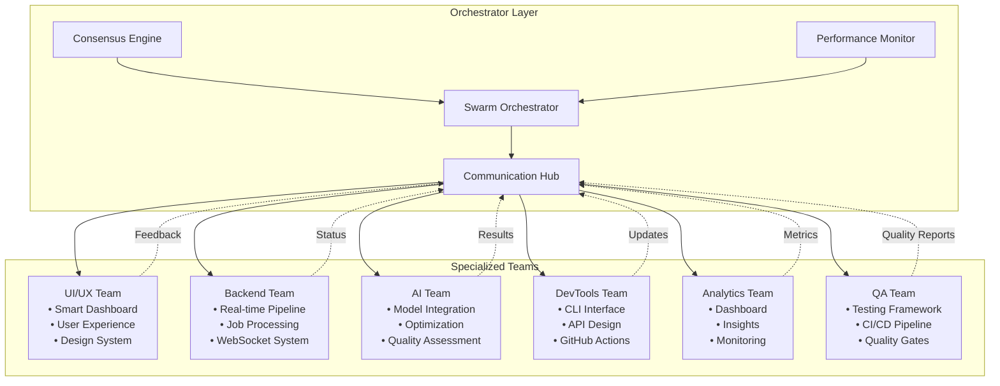
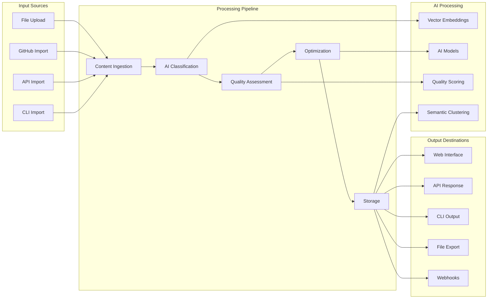
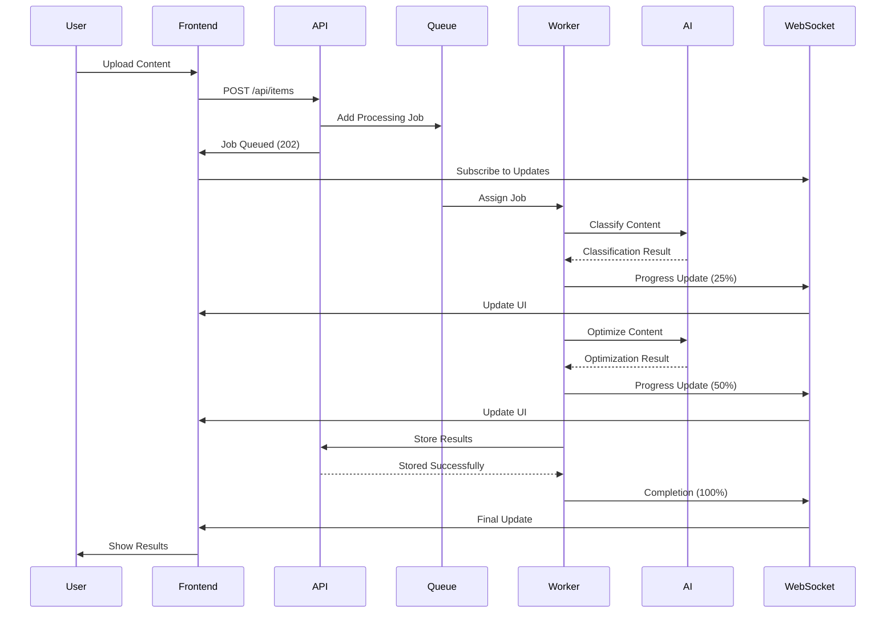
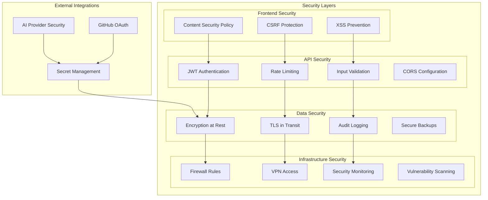
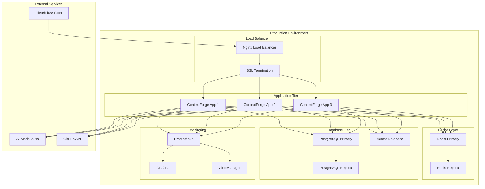
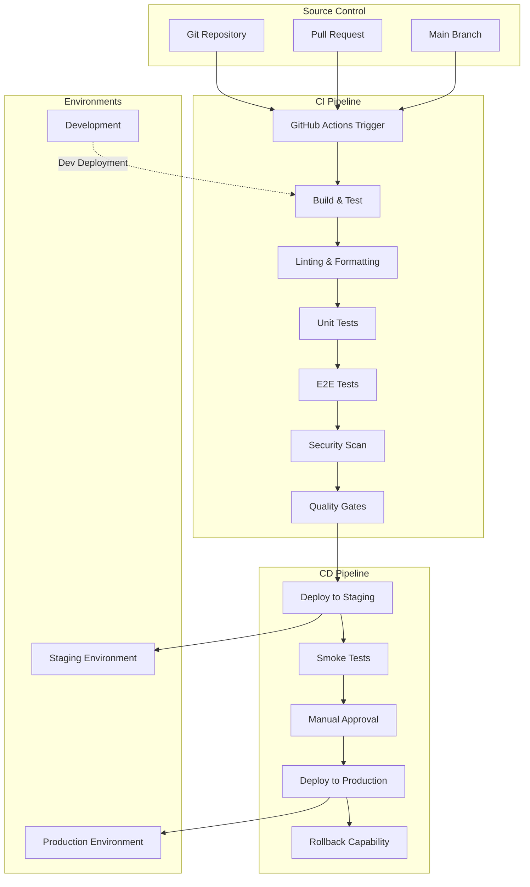
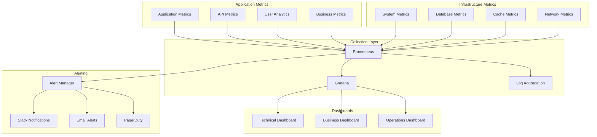

# ContextForge System Architecture Diagrams

## High-Level System Architecture

## Swarm Intelligence Orchestration

## Data Flow Architecture

## Real-time Processing Architecture

## Security Architecture

## Deployment Architecture

## CI/CD Pipeline Architecture

## Monitoring & Alerting Architecture

